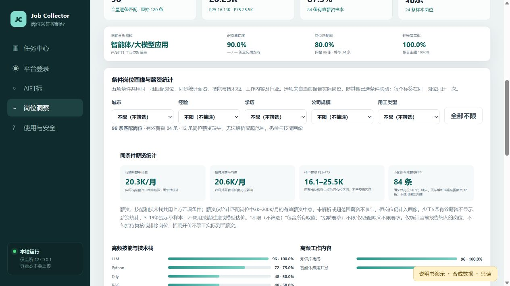

# Job Collector To Analysis

本机运行的岗位采集、去重交付、AI 标注与岗位市场洞察控制台。界面和采集服务仅监听 `127.0.0.1`，不应直接暴露到公网。

## 新手从这里开始

**[打开带截图的中文使用说明](docs/USER_GUIDE.md)**：从启动、登录、新建任务、暂停续采到岗位洞察和薪资筛选，按界面一步一步操作。

已有数据？直接进入“岗位洞察”。需要新数据？先登录所选平台，再创建采集任务。AI 打标是可选步骤，不是生成报告的前置条件。



上图及说明书的全部截图来自当前界面的**只读合成数据演示**，不是实际采集结果，也不是岗位筛选准确率验证。未公开真实账户、采集数据或私人路径。

## 本次源码快照

- 保留生产 `role-evidence-v2`：智能体/大模型应用采用上下文证据 v2，其他岗位族沿用通用关键词方案。
- 技术栈岗位画像合并了条件薪资统计；城市、经验、学历、公司规模、用工类型默认均不限，选项来自当前报告样本并联动。
- `work/role-evidence-v3-offline.mjs` 仅为离线实验，未接入生产分析入口，效果不能视为已验收。
- 不包含真实岗位数据、真实预标记/复核记录、模型评估产物、任务配置、账号信息、Cookie、浏览器配置、日志或第三方依赖包。
- 发布副本仅清理了私人路径和默认路径，并补充安装及测试入口；没有修改原本正在运行的服务或生产 v2 算法。

## 环境与依赖

当前浏览器管理主要面向 Windows：Node.js 22+、Python 3、完整安装的 Google Chrome；实例切换功能还需要 Microsoft Edge。Python 合并脚本使用标准库，无需 pip 安装。

```powershell
npm ci
npm test
npm start
```

默认控制台地址：`http://127.0.0.1:8765`。也可双击 `启动岗位采集控制台.bat`。

**重要限制：** Excel 导出和 XLSX/CSV 分析、标注通过 `@oai/artifact-tool`（本地验证版本 2.8.59）实现。它是 Codex 工作环境提供的非公开依赖，不随源码分发，`npm ci` 不会安装它。上述步骤可启动控制台和运行纯单元测试，但要使用完整数据读写/洞察流程，需在有权使用该依赖的环境中将其提供给本项目的 Node 模块解析路径。不要误认为普通电脑仅执行 `npm ci` 就具备完整功能；本次没有替换这个依赖或改写数据流程。

## 使用流程

1. 在平台登录页面，由人工完成平台登录及必要验证；采集与登录使用受管理的浏览器会话。
2. 新建采集任务，指定关键词、渠道、城市、目标条数和输出目录。
3. 按阶段运行采集、合并去重和 Excel 导出；暂停后从同任务同目录继续。
4. 选择最终交付数据集生成岗位市场洞察。报告按当前生产规则筛选目标岗位；待复核记录不纳入主统计。
5. 用五项条件联动查看技能画像和薪资中位数、均值及四分位区间。不限包含未明确值，招聘要求里的“经验不限”等则是具体类别。少于 5 条有效薪资样本不展示统计，5–19 条提示小样本，不作模型外推。

采集、AI 网页标注和数据传输须遵循平台条款与数据使用授权。遇到登录失效、验证码或账号保护，请人工处理，不自动破解或轮换规避验证。

## 本机配置

环境变量在启动前设置，程序不会自动读取 `.env`：

| 变量 | 用途 |
| --- | --- |
| `JOB_UI_PORT` | 服务端口，默认 8765；启动 BAT 内有独立默认值 |
| `JOB_UI_DATA_DIR` | 任务、状态、日志与洞察目录，默认项目 `ui_data/` |
| `JOB_UI_OPEN_BROWSER` | 设置为 `1` 时启动后打开控制台 |
| `JOB_UI_PYTHON` | 合并数据时使用的 Python 可执行文件 |
| `JOB_UI_NODE` | BAT 使用的 Node 可执行文件 |
| `JOB_INSIGHT_DATASET_ROOT` | 发布副本的数据集发现根目录，默认项目 `outputs/` |
| `JOB_BROWSER_PROFILE_ROOT` | 受管理浏览器配置根目录，默认 `%LOCALAPPDATA%/CodexJobCollectorProfilesV2` |

本机数据和浏览器会话不要提交到 Git。任务输出配置仍可指向用户自行选择的目录。

## 目录与测试

```text
job_collector_ui/server.mjs   本机 HTTP 服务和任务编排
job_collector_ui/public/      页面、样式、交互及地图静态资源
work/collect_*.mjs            招聘平台采集入口
work/managed_browser*.mjs     浏览器实例与会话管理
work/finalize_configurable_dataset.py  合并去重与质量报告
work/analyze_job_market_sample.mjs     分析生产入口
work/role-evidence-v2.mjs     智能体岗位上下文证据筛选
work/test_*.mjs               单元/历史集成测试源码
scripts/run-unit-tests.mjs    不依赖真实数据或登录的平台无关测试集
```

`npm test` 只运行列明的单元脚本，不运行网页采集或读取生产服务。其他 `test_*.mjs` 含历史集成和回归脚本，部分依赖本机报告、私有组件、浏览器安装或旧 UI，不保证直接可运行，不要对生产服务盲目执行。条件薪资测试无本机报告时只验证合成样本；若自行提供 `ui_data/insights/岗位市场洞察.json`，额外执行真实报告检查。

### 安全查看演示界面

```powershell
npm run docs:demo
```

打开 `http://127.0.0.1:18979`。演示使用真实前端源码和合成数据，所有非 GET 请求均拒绝，不连接真实登录账户，不运行采集、标注或文件导出，不读取生产 `ui_data`。退出时在该终端按 `Ctrl+C`。界面上的操作按钮不代表演示服务能执行相应业务。

`npm run test:docs` 核验演示接口及只读保护；截图保存于 `docs/images/`。

## 第三方资源

`public/vendor/d3.min.js` 为 D3 v7.9.0，保留原作者版权及 ISC 许可（见 `THIRD_PARTY_NOTICES.md`）。地图边界来自 DataV 公开行政区边界服务，来源与城市编码记录于 `public/maps/source.json`；使用或再分发时请另行核对数据提供方的许可和适用限制。项目未额外授予第三方资源的权利。
