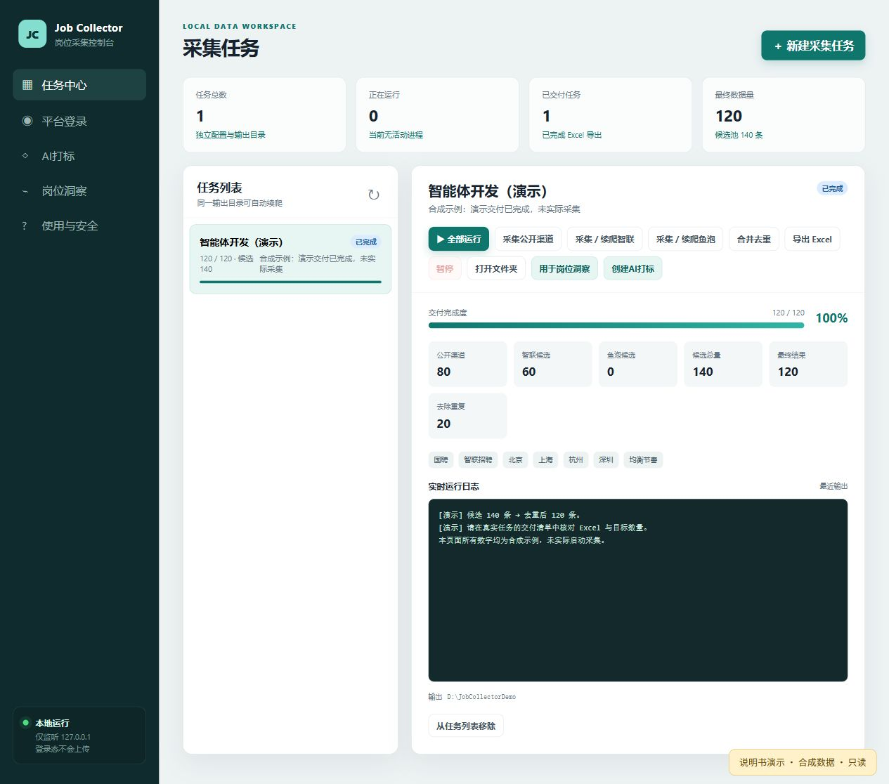
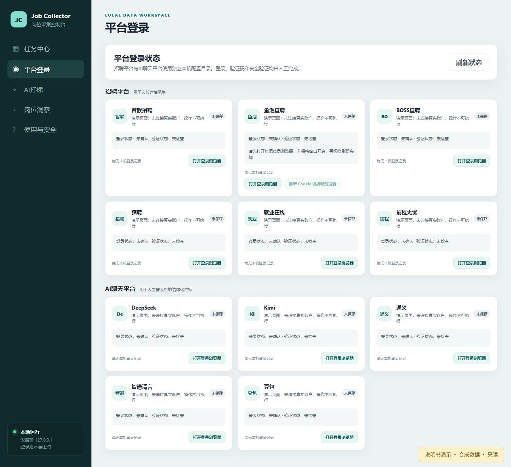
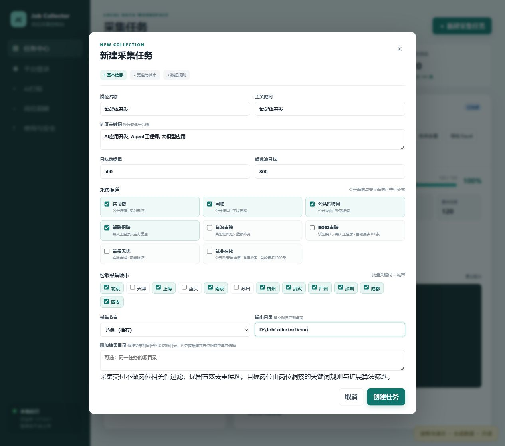
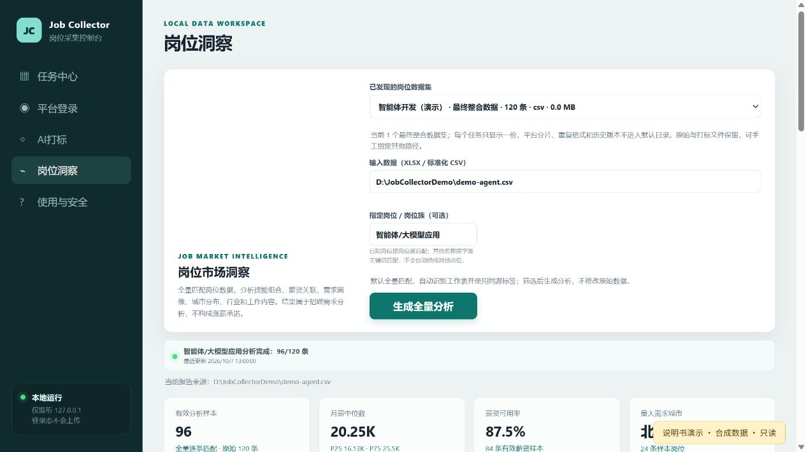
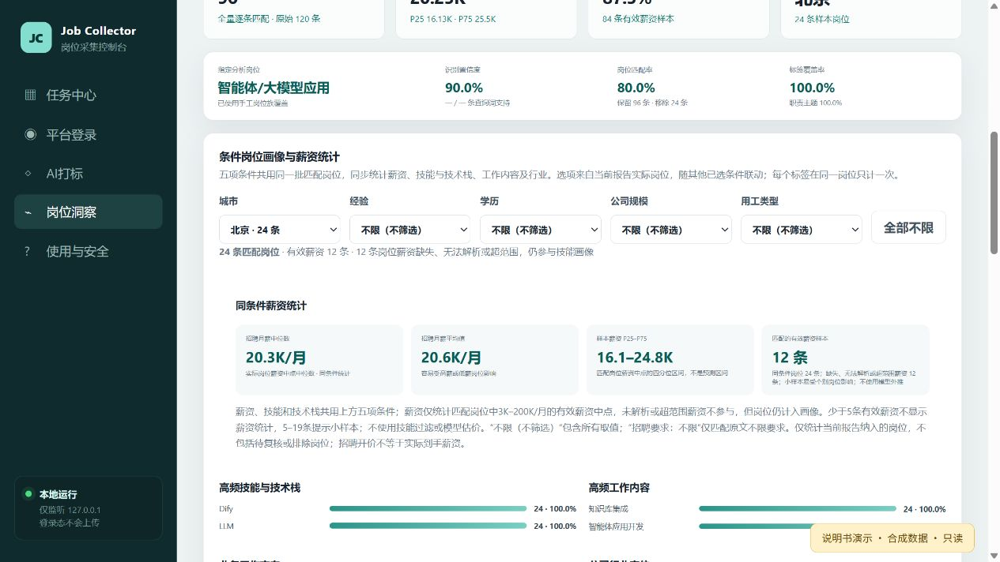
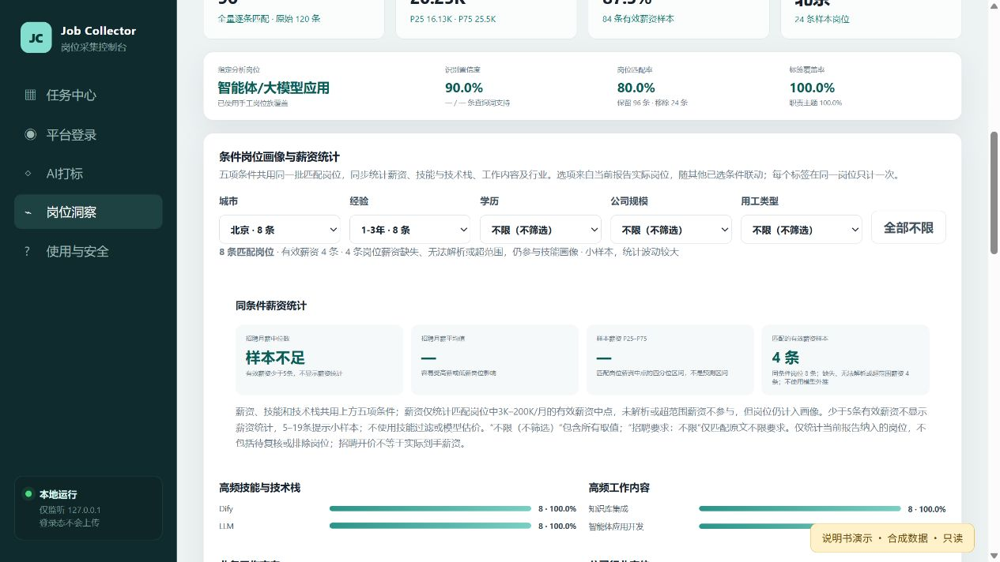
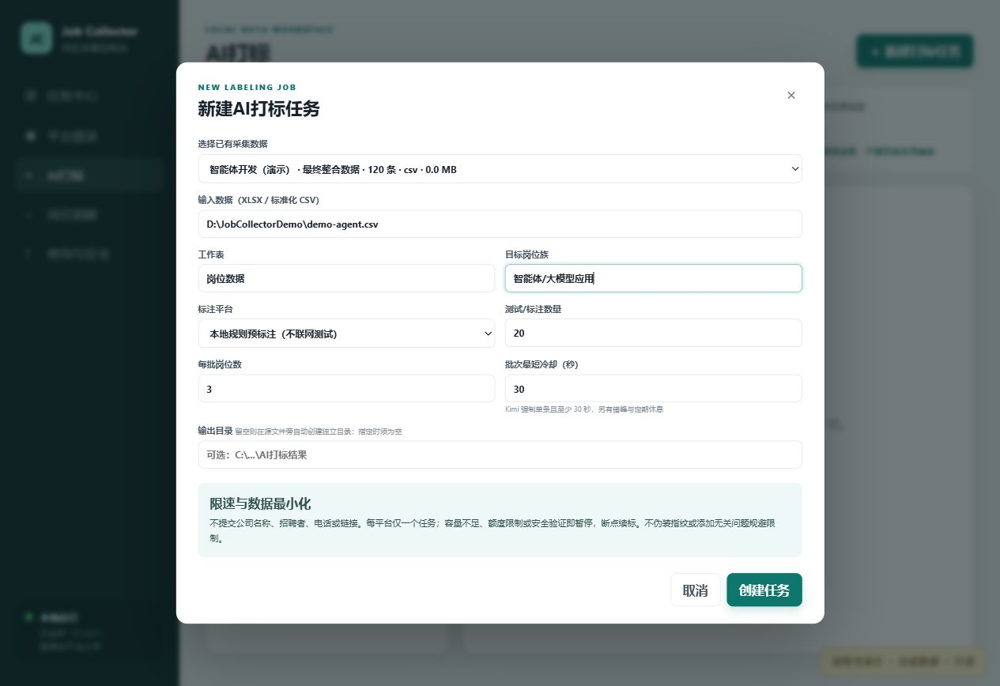

# 岗位采集与分析控制台 · 图文使用说明

文档更新：2026-10-08。适用版本：2026-10-07 的源码快照，生产筛选仍为 v2。返回 [项目首页](../README.md)。

这套系统分成两件事：**采集中心把数据收集、去重并交付；岗位洞察再从交付数据里筛出目标岗位，生成画像和薪资统计。** 采集条数不等于最后纳入分析的条数。

本说明书的 8 张截图均取自当前前端的只读演示。岗位、数字、路径都是合成示例，没有真实登录账户；截图中的结果不是算法效果验证。图片可点开查看原图。

## 1. 先选你的使用方式

- **已经有 XLSX / CSV：** 直接看 [第 6 节：生成岗位洞察](#6-生成岗位洞察)，不必先创建采集或打标任务。
- **要采集新岗位：** 按“打开控制台 → 平台登录 → 新建采集任务 → 运行 → 核对交付”操作。
- **只想了解界面：** 在已安装 Node.js 的项目目录运行 `npm run docs:demo`，打开 `http://127.0.0.1:18979`。这是只读演示，点击业务按钮不会采集或登录。

## 2. 打开控制台

如果是在已经配置好的本机使用，双击项目目录中的 **启动岗位采集控制台.bat**，按终端显示的网址进入。默认是 `http://127.0.0.1:8765`；已有服务可能使用其他端口，请以启动输出为准。保持终端窗口开启。

如果是首次下载源码到另一台电脑，先看 [安装与依赖说明](../README.md#环境与依赖)：需要 Node.js 22+、Python 3、Chrome；实例切换还需要 Edge。**完整 Excel/CSV 分析、标注及导出还依赖非公开的 `@oai/artifact-tool`，普通 `npm ci` 不会安装它。** 未具备该依赖时，可查看控制台或演示，但不能保证完整业务可运行。

四个入口各做什么：

| 左侧入口 | 用途 |
| --- | --- |
| 任务中心 | 新建采集、看进度、暂停续采、合并与导出 |
| 平台登录 | 打开采集/AI 平台的共享浏览器，人工登录和验证 |
| AI 打标 | 可选：给岗位补充结构化技能、职责标签并复核 |
| 岗位洞察 | 选择数据、筛选目标岗位、查看画像与条件薪资 |

## 3. 平台登录：登录后不必关闭浏览器

1. 点击左侧 **平台登录**。
2. 找到本次要用的平台，点击 **打开登录浏览器**。
3. 在打开的窗口中人工完成登录、扫码及平台要求的验证。
4. 保持该窗口开启，回到控制台运行任务。采集复用该平台的受管理实例；不要另开日常浏览器来代替。

“共享浏览器已开启”只代表窗口存在，**不代表账号已登录、验证已通过**；“会话已保存”也不代表登录永久有效。出现登录失效或验证码，先在对应平台窗口人工处理。

### 鱼泡的“携带 Cookie 切换新浏览器”

它是**手动迁移会话**的按钮，不是遇到验证码自动换实例的开关。原窗口需要开启；鱼泡正在登录或采集时，请等待完成或先暂停，按钮满足条件才可用。切换完成后，后续鱼泡采集会使用新实例；仍需人工确认新窗口的登录状态，切换不能保证免验证。

暂时不采鱼泡：新建任务时不勾选它。既有任务若鱼泡受阻，可暂停后只运行已选的可用渠道，再合并、导出；这不等于删除鱼泡阶段，之后点“全部运行”仍可能进入该阶段。不要反复点击验证受阻的渠道。

## 4. 新建采集任务：先小批验证，再扩大目标

点击右上角 **新建采集任务**。例如要研究智能体开发：

| 字段 | 推荐怎么填 |
| --- | --- |
| 岗位名称 | `智能体开发`，用于识别任务与输出文件 |
| 主关键词 | `智能体开发`，作为检索入口 |
| 扩展关键词 | `AI应用开发, Agent工程师, 大模型应用`；逗号或换行分隔 |
| 目标数据量 | 先用较小数量确认渠道与字段正常；这是去重交付目标，不保证能达到 |
| 候选池目标 | 通常设得比目标量大，用于预留重复、缺字段等损耗；不保证分析相关度 |
| 渠道与城市 | 只选需要且允许使用的渠道；登录渠道需事先人工登录 |
| 采集节奏 | 默认均衡；平台限制、账号状态与实际运行日志优先 |
| 输出目录 | 建议专门的岗位数据目录；系统在其下为任务隔离数据，续采不要换目录 |
| 附加结果目录 | 通常留空；只接受同任务 ID 的源目录，不用于混入历史任务数据 |

点击 **创建任务** 只建立任务配置，接下来才开始运行。不同岗位、不同任务不要混用输出文件。

## 5. 运行、暂停与确认交付

在任务中心选中任务：

- **全部运行：** 按任务已选渠道依次采集，再合并去重、导出 Excel。
- **采集公开渠道 / 采集或续爬智联、鱼泡：** 只执行对应阶段。没有选中的渠道不应当作当前任务来源。
- **暂停：** 请求停止当前采集。等状态显示已暂停，再进行下一步。
- **续采：** 对同一个任务点击原采集阶段，继续使用原目录和断点。不要为续采重建任务。
- **合并去重 → 导出 Excel：** 分步运行时，采集后按这个顺序操作。

暂停时尚未落盘的一小段可能重采；最终按“平台 + 岗位 ID”去重。**从任务列表移除**只是归档，不会删除输出文件；运行中要先暂停。

### 哪个数量才是交付数量？

“公开渠道、智联候选、候选总量”是采集过程指标；**最终结果**才是本任务去重后的交付量。列表或详情阶段尚未汇总时数字可能暂为 0，应同时查看实时日志，不能仅凭 0 就判断卡住。

进入 **打开文件夹**，确认同任务的：

1. `数据质量报告.json`：`task_id` 正确，查看 `output_rows` 和 `target_reached`。
2. `最终交付清单.json`：归属同任务，且列出的 Excel 实际存在、非空并能打开。
3. 控制台最终数量与交付报告一致。

状态为 **未达目标** 时，本轮可以已经导出可用数据，但不能把它称为“目标完成”。“用于岗位洞察”会带入当前任务交付来源；不会把历史共享目录的结果算进本任务。

## 6. 生成岗位洞察

1. 从任务详情点击 **用于岗位洞察**，或直接进入左侧 **岗位洞察**。
2. 选择“已发现的岗位数据集”。每个任务默认显示一份最终整合数据；找不到时可手工填写本机 XLSX / 标准化 CSV 的完整路径。
3. 数据至少要有“岗位名称”和“岗位描述”字段；标准化英文列名也支持映射。薪资、城市等字段用于对应统计。CSV 不需要工作表；XLSX 自动选择工作表，优先“岗位数据”，否则首个工作表。
4. 不确定岗位族时保留“自动识别”；目标明确时填写 **指定岗位 / 岗位族**，如 `智能体开发`。
5. 点击 **生成全量分析**。系统默认全量逐条匹配，不需要另选抽样或全量模式。
6. 查看“分析完成：纳入条数 / 原始条数”，并核对下方 **当前报告来源**。

### “指定岗位 / 岗位族”不是简单的标题搜索

已知名称先映射到岗位族，然后以该岗位族学习的关键词和匹配规则逐条筛选。当前智能体/大模型应用使用生产 v2：分别读取职责、任职要求等证据，结合领域工程上下文判断；仅在公司介绍提到技术词，或只是使用 AI 辅助工作，不会因此直接放行。其他岗位族仍沿用通用关键词方案；未知岗位名称按字面关键词匹配，不会悄悄替换成其他岗位族。

不确定的记录独立保留在待复核清单，不计入主报告薪资、城市和技能统计。自动纳入也不是人工确认，仍可能误收或漏选；需要严谨结论时，应抽查原文。**本次图文更新没有替换 v2。**

修改输入文件或岗位族后，要重新点击“生成全量分析”。页面可能保留上一份成功报告，请留意来源提示，不能把旧报告当成新结果。若任务归属校验或文件路径报错，先核对当前文件与任务来源，不要混入历史任务文件来凑数量。

## 7. 看薪资：五项条件和技能画像共用一批岗位

在 **条件岗位画像与薪资统计** 中，选择城市、经验、学历、公司规模、用工类型。五项默认都是 **不限（不筛选）**；点击 **全部不限** 可恢复。

- 下拉选项来自当前报告里实际存在的岗位，随其他条件联动，并显示岗位数。不是通用固定列表。
- 各条件之间是“同时满足”，不是“满足其中一项”。加条件通常会缩小样本。
- **不限（不筛选）** 包含该字段全部值，也包括未明确；**经验不限、学历不限、招聘要求：不限** 是原始招聘要求里的具体类别，两者不同。
- 薪资模块没有技能筛选或模型估价。技能/技术栈显示同一批匹配岗位的频率，不是按某个技能给个人定价。
- 下拉只改变当前报告内的画像与薪资区域；不会重新运行岗位筛选，也不会把已排除或待复核记录加回来。页面顶部总样本与整体图表仍以整份报告为准。

### 读懂四个薪资数字

| 指标 | 含义 |
| --- | --- |
| 月薪中位数 | 把每个岗位的薪资中点排序后取中间值；`20K` 表示约 20,000 元/月 |
| 月薪平均值 | 有效薪资中点的算术平均，更容易受极高/极低值影响 |
| P25–P75 | 中间约一半有效薪资样本的区间，不是预测区间或求职保证 |
| 有效薪资样本 | 条件匹配岗位中，能解析且中点在 3K–200K/月范围内的薪资记录 |

没有有效薪资的岗位仍可参与技能画像，因此“匹配岗位”可能多于“有效薪资样本”。少于 5 条有效薪资不展示薪资统计；5–19 条会提示小样本。招聘开价不等于实际到手工资或个人身价。

### 筛完是 0 条或“样本不足”，怎么做？

先看“匹配岗位”与“有效薪资”这两个数，再处理：

1. **匹配岗位为 0：** 当前条件组合没有岗位。点“全部不限”，再逐项选；不要一次叠加全部条件。
2. **岗位不为 0，薪资为 0：** 有岗位，但薪资缺失、无法解析或超出统计范围；不是没有岗位。
3. **有效薪资为 1–4 条：** 样本不足，系统主动不显示薪资。放宽条件，或增加合规数据后重新生成报告。
4. **全部不限仍无岗位：** 确认报告来源、指定岗位和纳入数量；必要时抽查待复核记录。条件下拉不能修复上游岗位筛选或自动放行待复核岗位。

系统不会为了显示一个价格，偷偷借用其他城市、放宽条件或用模型外推。

## 8. AI 打标是可选的，不必先做它

需要补充技能和职责标签时，再进入 **AI 打标 → 新建打标任务**：选择同一数据文件、目标岗位族、平台，先用默认 20 条验证输出。本地规则预标注不联网，但不是人工金标准，也不等于适用于所有岗位族。

使用聊天平台时先人工登录。每个平台只运行一个任务；保持冷却设置，Kimi 限制单条且至少 30 秒。系统尽量减少发送字段，但岗位原文本身可能包含敏感信息，发送到第三方 AI 平台前仍需确认你有权处理并去除不必要的敏感内容。

完成后在任务详情 **人工复核**：对照原文证据批准或驳回。洞察会自动选取同源、满足条件的标签补充属性；不能把其他数据集的标签混用，也不是用标签替代生产岗位筛选。批准后标签正文若发生变化，原批准会失效。新增或更改标签后，需重新生成洞察才会影响报告。

## 9. 常见问题速查

| 情况 | 安全处理方式 |
| --- | --- |
| 页面打不开 | 查看启动终端是否仍在运行，以及实际端口；不要同时启动多个实例抢同一端口 |
| 提示缺少 `@oai/artifact-tool` | 当前环境没有完整数据读写依赖；看项目 README，不要误以为 Playwright 安装即可解决 |
| 登录失效、验证码、账号保护 | 在对应平台窗口人工处理；任务暂停后从原阶段继续，或暂时使用其他可用渠道 |
| 浏览器切换按钮灰色 | 查看按钮附近原因提示；先确认原窗口开启，登录/采集已停止，新浏览器程序已安装 |
| 输出文件被占用 | 保存并关闭 Excel/WPS 中对应文件，确认文件可访问，再重新执行失败阶段 |
| 日志长时间无新增 | 核对渠道、关键词、城市、当前阶段和进程状态；先诊断，不反复启动重复采集 |
| 报告显示上次数据 | 核对来源提示；当前输入或岗位族改动后重新生成，不把旧报告当新结果 |
| 想看历史报告或原始数据 | 手工选择对应文件；不要把它们算进另一个任务的最终交付 |

任务配置、运行状态与日志默认保存在项目 `ui_data/`，采集结果在任务指定目录。浏览器登录会话保存在本机平台配置目录，**不要上传这些文件、真实岗位数据或 Cookie 到公开 GitHub**。提交截图前也要检查账号、个人路径和原文信息。

遇到问题时，提供错误文字、当前阶段和脱敏截图即可；不要贴出 Cookie、密码、访问令牌或完整个人信息。
